# Windows Server Active Directory Lab

## Project Overview
This lab walks through setting up a Windows Server 2019 domain controller from scratch using VirtualBox. I wanted to get hands-on experience with the stuff most SOC and help desk jobs assume you already know: how a domain gets built, how user accounts are managed centrally, and how to check that everything is actually healthy once it's running.

## Setup
* Hypervisor: Oracle VirtualBox
* OS: Windows Server 2019 Standard (Desktop Experience)
* VM specs: 2 vCPUs, 4GB RAM, 40GB dynamically allocated storage
* Network: Bridged adapter, static IP (192.168.12.139)
* Domain/Forest: NMG.com
* Hostname: NMG-DC01

## What I Did

**Phase 1: Getting the VM Ready**
I set up the VM with enough resources to run Server 2019 comfortably, then did a manual install instead of using an unattended/automated setup — I wanted to see every step and understand what each one was doing, not just click through a script. After the install, I added VirtualBox Guest Additions so the display and mouse integration actually worked properly.

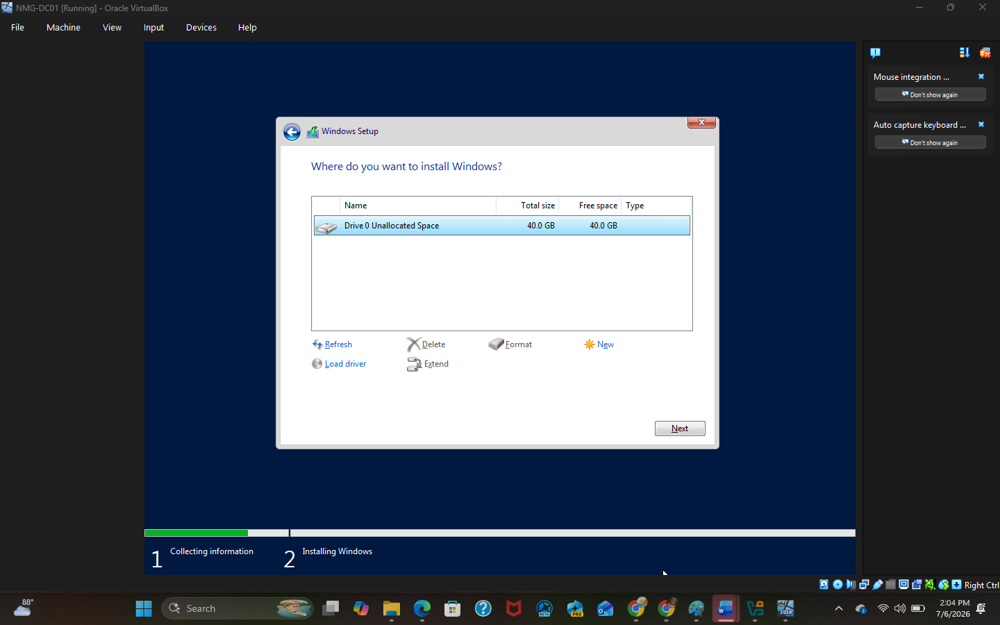
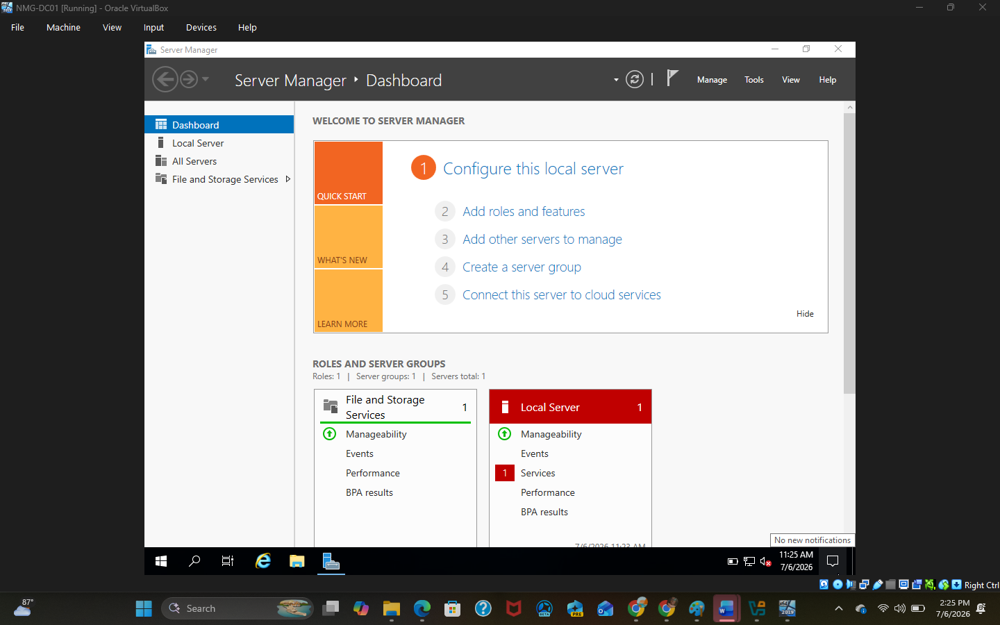
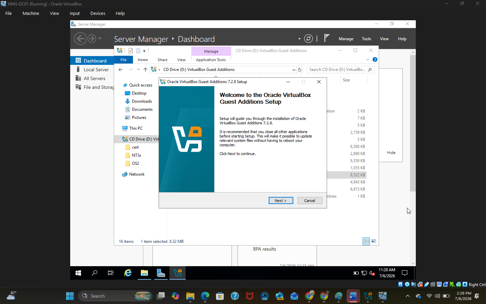

**Phase 2: Building the Domain Controller**
Before touching Active Directory, I gave the server a static IP so it wouldn't lose its identity on the network if the IP ever changed. Then I installed the AD DS and DNS roles through Server Manager, and promoted the server to be the first domain controller in a brand-new forest, NMG.com. I also set a DSRM password during that process, in case the server ever needs to go into directory restore mode.

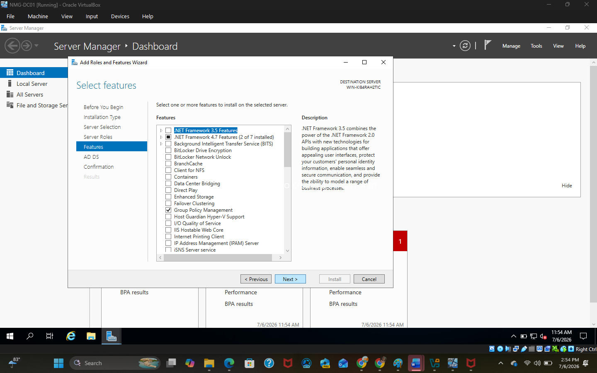
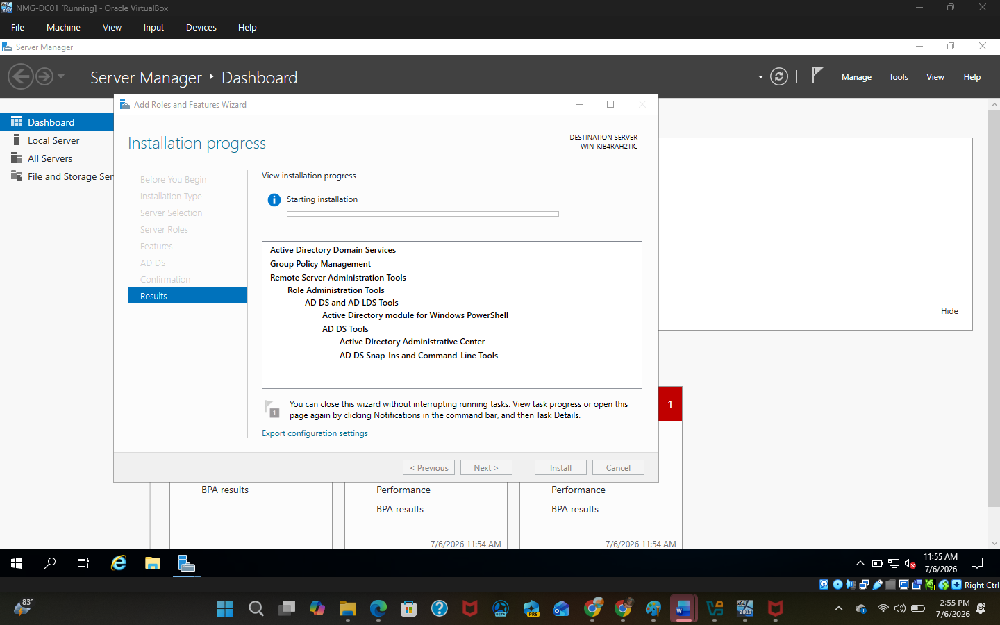
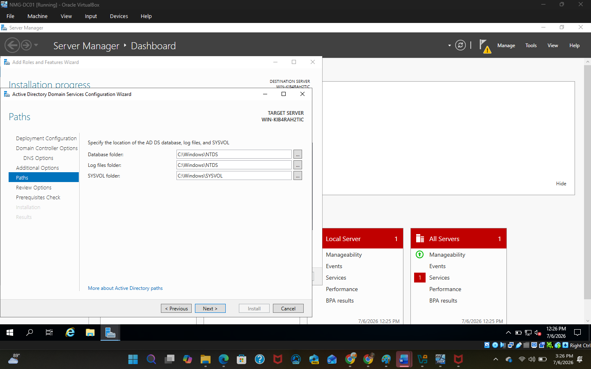
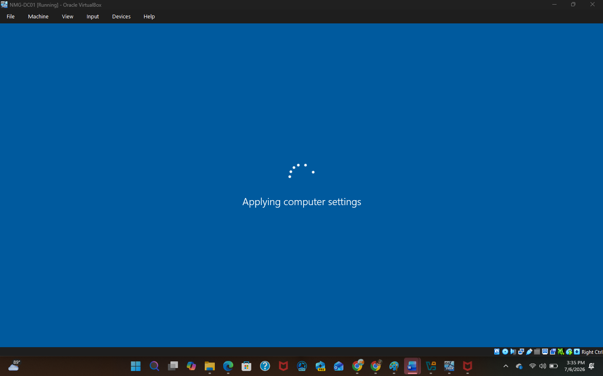
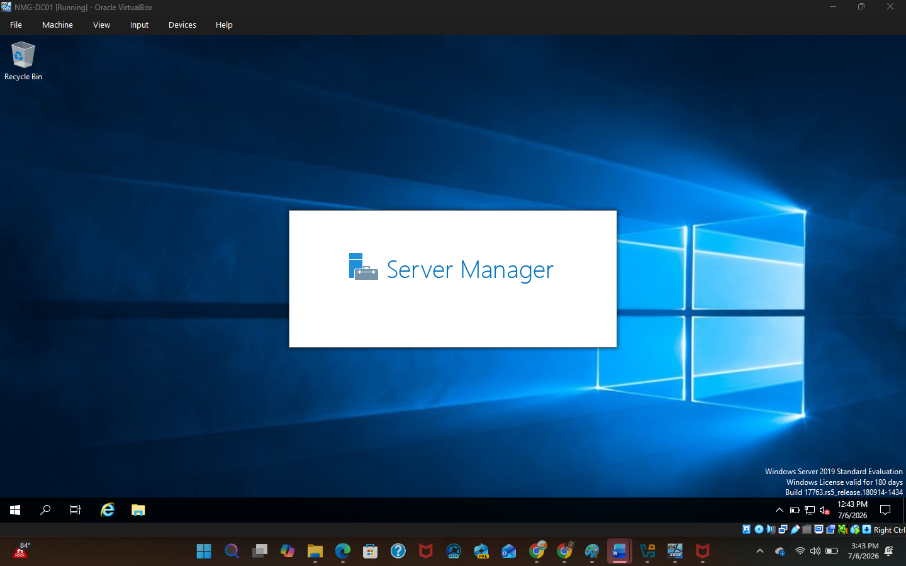
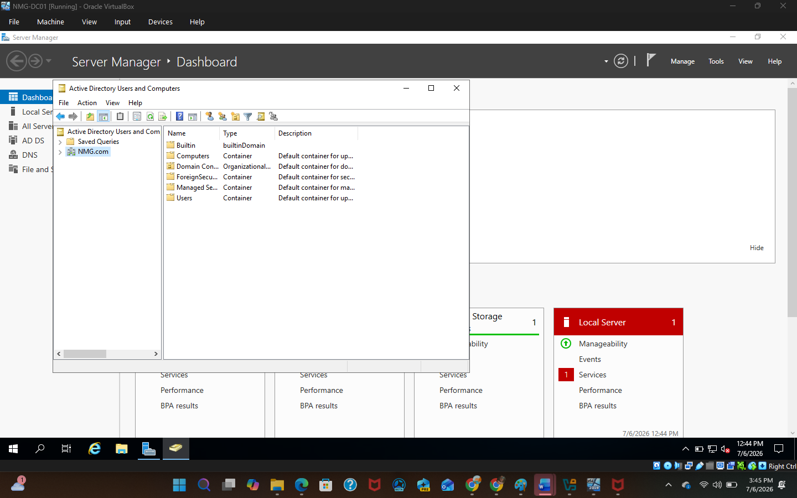
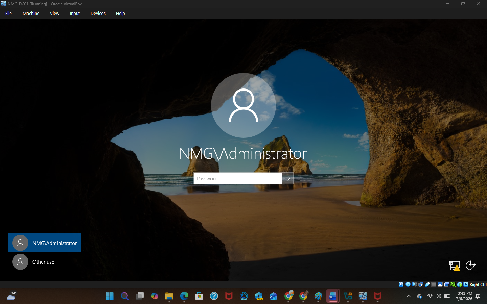

**Phase 3: Making Sure It Actually Works**
Once everything was set up, I checked that the directory structure was building correctly in Active Directory Users and Computers, and ran `dcdiag` from the command line to confirm the domain controller was healthy and there were no errors.

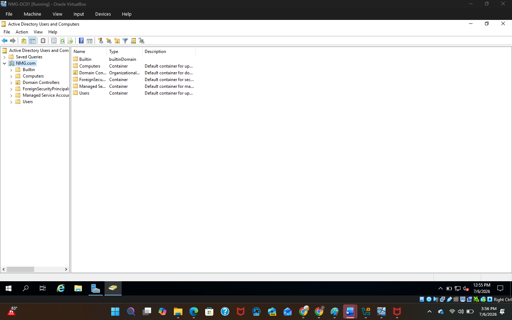

## Challenges & Troubleshooting (Lessons Learned)
A few things tripped me up during this build. Here's what happened and how I worked through each one:

**1. VirtualBox kept trying to auto-install Windows for me**
VirtualBox has an "Unattended Install" feature that tries to automate the whole OS setup — it picks the settings for you. I didn't want that, since the point of this lab was to actually configure everything myself, including naming the machine `NMG-DC01`. I fixed this by checking "Skip Unattended Installation" in the VM setup wizard, which let me go through the normal manual Windows install instead.

**2. Picking the right Windows Server edition**
When you get to the OS selection screen, Windows Server 2019 shows up as several different versions, and it's easy to accidentally pick the wrong one. I specifically needed Windows Server 2019 Standard Evaluation (Desktop Experience) — not Server Core — because Server Core doesn't come with a graphical interface, and I needed Server Manager and the other admin consoles to actually be usable.

**3. My mouse kept getting stuck inside the VM**
After installing the OS, my cursor would get trapped inside the VM window and I couldn't click back out to my host machine. Turns out this is normal until you install Guest Additions. I hit the Host key (Right Ctrl) to release the mouse, then mounted the VirtualBox Guest Additions ISO from inside the VM and ran `VBoxWindowsAdditions-amd64.exe` to install the proper drivers. After that, the mouse moved freely between host and guest like normal.

**4. AD DS setup threw a DNS delegation warning**
While promoting the server to a domain controller, the wizard threw a warning saying it couldn't create a DNS delegation. At first this looked like an error, but it's actually expected here — since `NMG.com` is a brand-new root domain with no parent DNS zone above it, there's nothing to delegate to. I confirmed this was normal and moved on.
